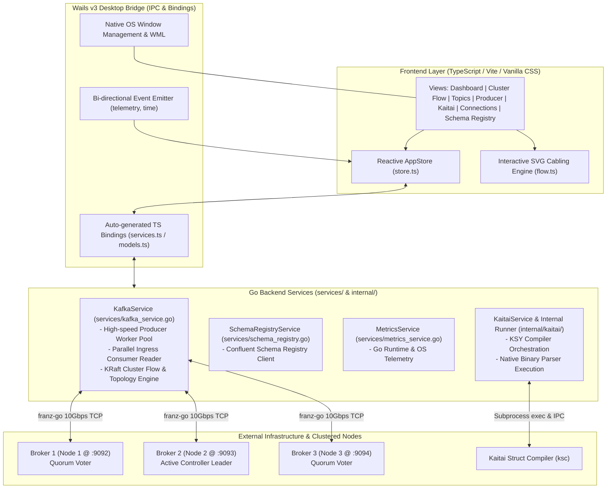
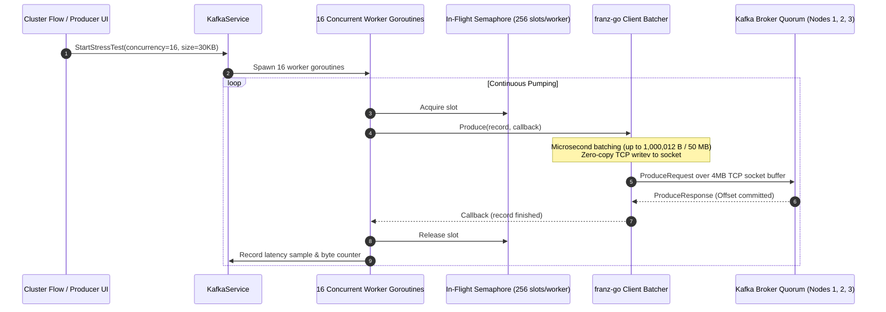
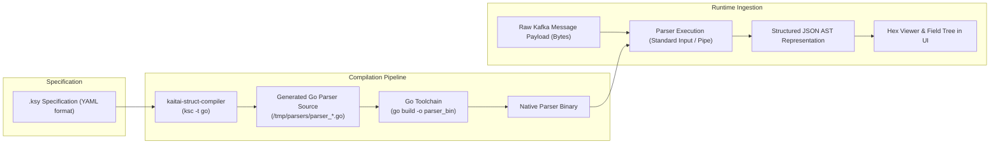
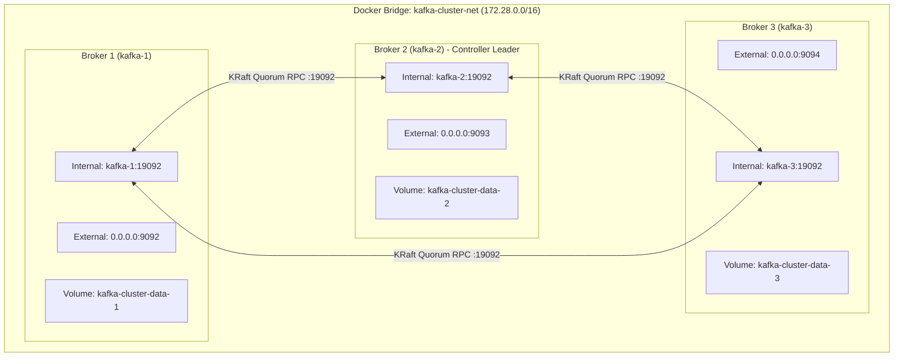

# KafkaKaitai System Architecture Reference

This document provides a comprehensive technical reference for the **KafkaKaitai** architecture, describing the design of the Go backend engine, Wails v3 desktop runtime, TypeScript frontend layer, Kaitai binary decoding pipeline, and KRaft cluster orchestration.

---

## 1. High-Level Architecture Overview

KafkaKaitai is built as a high-performance desktop platform combining a native Go backend powered by `franz-go` with a glassmorphic Vite/TypeScript frontend connected over Wails v3 zero-overhead IPC bindings.



---

## 2. Component Architecture

### A. Go Backend Services

| Component | File Path | Core Responsibilities |
| :--- | :--- | :--- |
| **Main Entrypoint** | [`main.go`](file:///var/home/okuu/projects/kafka_kaitai/main.go) | Initializes Wails v3 application, binds Go services, registers background telemetry tickers (1 Hz), configures window sizing and dark background. |
| **Kafka Engine** | [`services/kafka_service.go`](file:///var/home/okuu/projects/kafka_kaitai/services/kafka_service.go) | Manages `franz-go` client lifecycle, producer worker concurrency, benchmark consumer, metadata querying, topic creation, partition offset watermarks, and cluster topology. |
| **Kaitai Subsystem** | [`internal/kaitai/runner.go`](file:///var/home/okuu/projects/kafka_kaitai/internal/kaitai/runner.go) | Ingests `.ksy` YAML specifications, compiles Go parsers via `ksc`, compiles native binaries, runs memory-mapped or pipe execution against raw byte payloads. |
| **Kaitai Service** | [`services/kaitai_service.go`](file:///var/home/okuu/projects/kafka_kaitai/services/kaitai_service.go) | Manages format library, schema validation, compilation status, and schema-to-topic associations. |
| **Schema Registry** | [`services/schema_registry.go`](file:///var/home/okuu/projects/kafka_kaitai/services/schema_registry.go) | Communicates with Confluent/Aiven Schema Registries to fetch schemas, list subjects, and resolve schema IDs. |
| **System Telemetry**| [`services/metrics_service.go`](file:///var/home/okuu/projects/kafka_kaitai/services/metrics_service.go) | Gathers live memory allocations, system memory usage, active goroutine count, and GC pause cycles. |

---

### B. High-Speed Kafka Engine Internals

To achieve **>2,400 MB/s** and **>85,000 msg/s** on 30KB payloads, the engine avoids common bottlenecks (such as synchronous locking, excessive heap allocations, and undersized socket buffers):



#### Key Performance Optimizations
1. **Bounded In-Flight Semaphore**: Each worker goroutine manages an internal channel semaphore (`chan struct{}`) capped at 256. This prevents unbounded queueing while keeping network pipelines fully saturated.
2. **Strict Batch Boundary Sizing**: `kgo.MaxProduceBatchBytes(1_000_012)` ensures batches match broker maximum boundaries without triggering `MESSAGE_TOO_LARGE` errors.
3. **Partition-Aware Client Round-Robin**: Automatically fans out records across all topic partitions (e.g. 24 partitions across 3 nodes), saturating all broker I/O threads evenly.
4. **Latency Quantile Histograms**: Records round-trip latencies into a reservoir, computing rolling P50, P95, P99, and Average latency without holding global write locks during message production.

---

### C. Kaitai Struct Binary Decoding Pipeline

KafkaKaitai allows decoding arbitrary proprietary or standard binary payloads directly off Kafka topics without pre-compilation into the main application:



- **Cached Compilations**: Parser binaries are hashed and cached in `~/.kafka_kaitai/parsers/` to ensure zero compilation latency on repeat inspections.
- **Fail-Safe Sandboxing**: The parser executes in an isolated process with execution timeouts to prevent malformed binary packets from crashing the main desktop application.

---

### D. Frontend View Architecture

The frontend is implemented with Vanilla TypeScript and reactive store subscriptions, avoiding heavy framework overhead while maintaining responsive 60 FPS interactions.

```
frontend/src/
├── main.ts                   # Application shell, sidebar navigation, 400ms polling loop
├── store.ts                  # Reactive AppStore, telemetry cache, localStorage persistence
├── styles/
│   └── theme.css             # Glassmorphism dark tokens, SVG cable styling, keyframes
├── components/
│   ├── modal.ts              # Native dialog modals
│   ├── toast.ts              # Floating animated notification toasts
│   └── hexviewer.ts          # Interactive binary/hex inspector
└── views/
    ├── dashboard.ts          # High-level cluster overview & telemetry tiles
    ├── flow.ts               # Interactive 3-stage pipeline with dynamic SVG cabling
    ├── topics.ts             # Topic partition grid, consumer message viewer
    ├── producer.ts           # Producer bench, payload generator, latency curves
    ├── kaitai.ts             # KSY schema editor & test workbench
    ├── connections.ts        # Bootstrap servers & SASL/TLS authentication settings
    └── schemaregistry.ts     # Schema registry explorer
```

#### Dynamic SVG Cabling Engine (`flow.ts`)
The `Cluster Flow` view calculates live DOM coordinates of:
1. Producer Ingress output anchor (`#anchor-prod-out`).
2. Broker node card input and output edges (`.broker-node-card`).
3. Consumer Ingress input anchor (`#anchor-cons-in`).

It draws cubic Bézier curves dynamically:
$$B(t) = (1-t)^3 P_0 + 3(1-t)^2 t P_1 + 3(1-t) t^2 P_2 + t^3 P_3$$
where control points $P_1$ and $P_2$ create horizontal tangent transitions. Active CSS dash animations (`@keyframes flowCableAnim`) pulse cyan when producing and emerald when consuming.

---

## 3. Cluster & Network Infrastructure

The local high-throughput cluster runs via Docker/Podman managed by [`scripts/kafka-cluster.sh`](file:///var/home/okuu/projects/kafka_kaitai/scripts/kafka-cluster.sh):



### Quorum Configuration Details
- **Cluster ID**: `4L622nShTUiBenVKBpahA0` (fixed KRaft storage format identifier).
- **Controller Quorum Voters**: `1@kafka-1:19092,2@kafka-2:19092,3@kafka-3:19092`.
- **Socket Buffer Tuning**:
  - `KAFKA_SOCKET_SEND_BUFFER_BYTES=4194304` (4 MB)
  - `KAFKA_SOCKET_RECEIVE_BUFFER_BYTES=4194304` (4 MB)
  - `KAFKA_SOCKET_REQUEST_MAX_BYTES=104857600` (100 MB envelope)
  - `KAFKA_MESSAGE_MAX_BYTES=52428800` (50 MB batch ceiling)
  - `KAFKA_NUM_NETWORK_THREADS=8`
  - `KAFKA_NUM_IO_THREADS=16`

---

## 4. Build & Lifecycle Commands Reference

| Operation | Command | Purpose |
| :--- | :--- | :--- |
| **Start Cluster** | `make cluster-up` / `task cluster:up` | Boots the 3-broker KRaft ensemble with kernel tuning. |
| **Stop Cluster** | `make cluster-down` / `task cluster:down` | Gracefully shuts down containers while keeping data volumes. |
| **Run Benchmark** | `make bench-cluster` / `task cluster:bench` | Executes the 2,400+ MB/s end-to-end performance test suite. |
| **Generate Bindings** | `make bindings` / `task bindings` | Re-generates TypeScript models and service proxies from Go structs. |
| **Frontend Build** | `npm --prefix frontend run build` | Compiles production assets via Vite into `frontend/dist`. |
| **Backend Test & Build** | `make test && make build-backend` | Runs unit tests and produces binary `bin/kafka-kaitai`. |
| **Dev Mode** | `make dev` / `task dev` | Runs Wails dev server with hot code reload on frontend and backend. |
